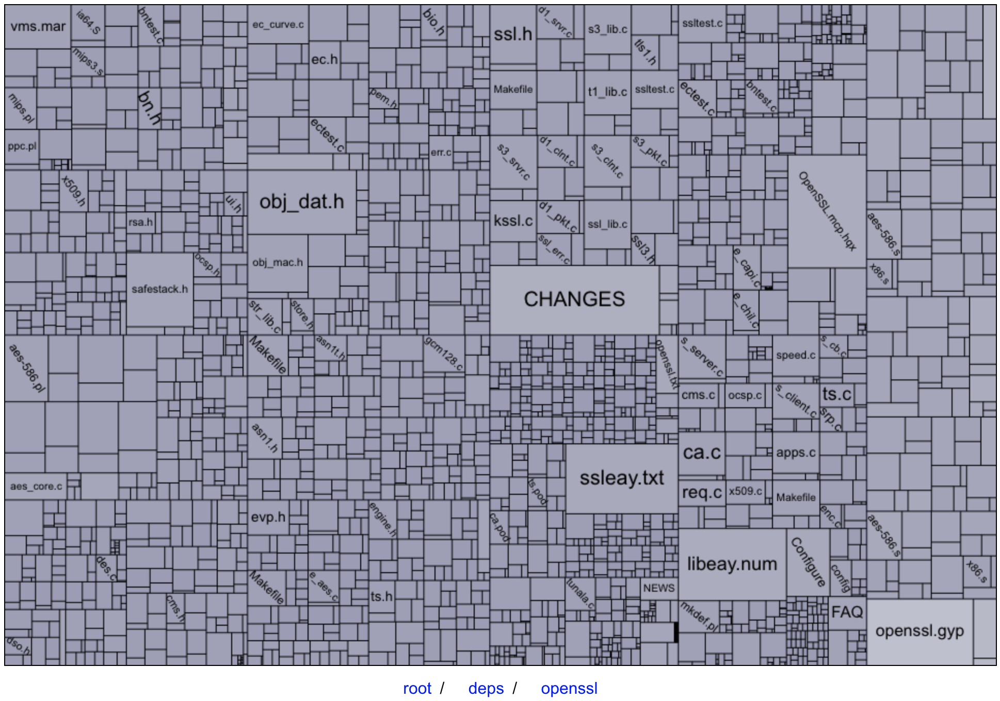
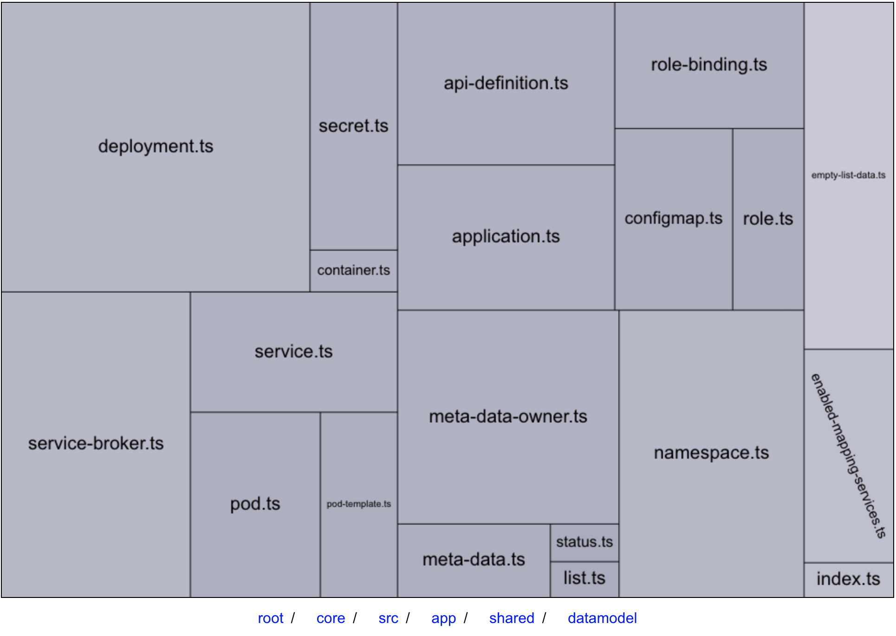

# Gitree

[Demo](https://wawrzyn321.github.io/gitree/)

It's like
> SpaceSniffer or WinDirStat

for
> Github repositories

!

## Images

[Node JS](https://github.com/nodejs) / [Node](https://github.com/nodejs/node)

[Kyma Project](https://github.com/kyma-project) / [Console](https://github.com/kyma-project/console)

